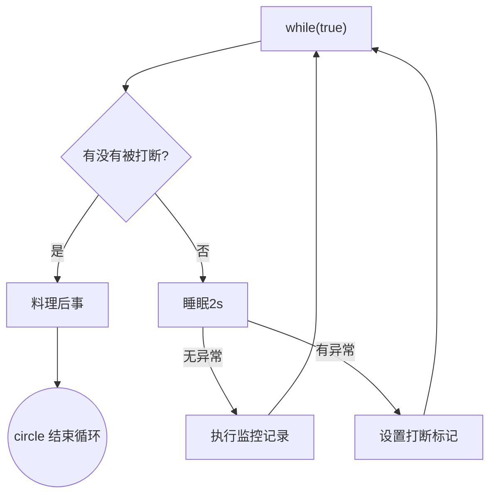

# 线程方法

### API

Thread 类 API：

| 方法                                        | 说明                                                         |
| ------------------------------------------- | ------------------------------------------------------------ |
| public void start()                         | 启动一个新线程，Java虚拟机调用此线程的 run 方法              |
| public void run()                           | 线程启动后调用该方法                                         |
| public void setName(String name)            | 给当前线程取名字                                             |
| public void getName()                       | 获取当前线程的名字 线程存在默认名称：子线程是 Thread-索引，主线程是 main |
| public static Thread currentThread()        | 获取当前线程对象，代码在哪个线程中执行                       |
| public static void sleep(long time)         | 让当前线程休眠多少毫秒再继续执行 **Thread.sleep(0)** : 让操作系统立刻重新进行一次 CPU 竞争 |
| public static native void yield()           | 提示线程调度器让出当前线程对 CPU 的使用                      |
| public final int getPriority()              | 返回此线程的优先级                                           |
| public final void setPriority(int priority) | 更改此线程的优先级，常用 1 5 10                              |
| public void interrupt()                     | 中断这个线程，异常处理机制                                   |
| public static boolean interrupted()         | 判断当前线程是否被打断，清除打断标记                         |
| public boolean isInterrupted()              | 判断当前线程是否被打断，不清除打断标记                       |
| public final void join()                    | 等待这个线程结束                                             |
| public final void join(long millis)         | 等待这个线程死亡 millis 毫秒，0 意味着永远等待               |
| public final native boolean isAlive()       | 线程是否存活（还没有运行完毕）                               |
| public final void setDaemon(boolean on)     | 将此线程标记为守护线程或用户线程                             |

### run start

run：称为线程体，包含了要执行的这个线程的内容，方法运行结束，此线程随即终止。直接调用 run 是在主线程中执行了 run，没有启动新的线程，需要顺序执行

start：使用 start 是启动新的线程，此线程处于就绪（可运行）状态，通过新的线程间接执行 run 中的代码

说明：**线程控制资源类**

run() 方法中的异常不能抛出，只能 try/catch

- 因为父类中没有抛出任何异常，子类不能比父类抛出更多的异常
- **异常不能跨线程传播回 main() 中**，因此必须在本地进行处理

### sleep yield

sleep：

- 调用 sleep 会让当前线程从 `Running` 进入 `Timed Waiting` 状态（阻塞）
- sleep() 方法的过程中，**线程不会释放对象锁**
- 其它线程可以使用 interrupt 方法打断正在睡眠的线程，这时 sleep 方法会抛出 InterruptedException
- 睡眠结束后的线程未必会立刻得到执行，需要抢占 CPU
- 建议用 TimeUnit 的 sleep 代替 Thread 的 sleep 来获得更好的可读性

yield：

- 调用 yield 会让提示线程调度器让出当前线程对 CPU 的使用
- 具体的实现依赖于操作系统的任务调度器
- **会放弃 CPU 资源，锁资源不会释放**

### join

public final void join()：等待这个线程结束

原理：调用者轮询检查线程 alive 状态，t1.join() 等价于：

```java
public final synchronized void join(long millis) throws InterruptedException {
    // 调用者线程进入 thread 的 waitSet 等待, 直到当前线程运行结束
    while (isAlive()) {
        wait(0);
    }
}
```

-  join 方法是被 synchronized 修饰的，本质上是一个对象锁，其内部的 wait 方法调用也是释放锁的，但是**释放的是当前的线程对象锁，而不是外面的锁** 
-  当调用某个线程（t1）的 join 方法后，该线程（t1）抢占到 CPU 资源，就不再释放，直到线程执行完毕 

线程同步：

- join 实现线程同步，因为会阻塞等待另一个线程的结束，才能继续向下运行 

- 需要外部共享变量，不符合面向对象封装的思想
- 必须等待线程结束，不能配合线程池使用

- Future 实现（同步）：get() 方法阻塞等待执行结果 

- main 线程接收结果
- get 方法是让调用线程同步等待

```java
public class Test {
    static int r = 0;
    public static void main(String[] args) throws InterruptedException {
        test1();
    }
    private static void test1() throws InterruptedException {
        Thread t1 = new Thread(() -> {
            try {
                Thread.sleep(1000);
            } catch (InterruptedException e) {
                e.printStackTrace();
            }
            r = 10;
        });
        t1.start();
        t1.join();//不等待线程执行结束，输出的10
        System.out.println(r);
    }
}
```

### interrupt

#### 打断线程

`public void interrupt()`：打断这个线程，异常处理机制

`public static boolean interrupted()`：判断当前线程是否被打断，打断返回 true，**清除打断标记**，连续调用两次一定返回 false

`public boolean isInterrupted()`：判断当前线程是否被打断，不清除打断标记

打断的线程会发生上下文切换，操作系统会保存线程信息，抢占到 CPU 后会从中断的地方接着运行（打断不是停止）

-  sleep、wait、join 方法都会让线程进入阻塞状态，打断线程**会清空打断状态**（false） 

```java
public static void main(String[] args) throws InterruptedException {
    Thread t1 = new Thread(()->{
        try {
            Thread.sleep(1000);
        } catch (InterruptedException e) {
            e.printStackTrace();
        }
    }, "t1");
    t1.start();
    Thread.sleep(500);
    t1.interrupt();
    System.out.println(" 打断状态: {}" + t1.isInterrupted());// 打断状态: {}false
}
```

-  打断正常运行的线程：不会清空打断状态（true） 

```java
public static void main(String[] args) throws Exception {
    Thread t2 = new Thread(()->{
        while(true) {
            Thread current = Thread.currentThread();
            boolean interrupted = current.isInterrupted();
            if(interrupted) {
                System.out.println(" 打断状态: {}" + interrupted);//打断状态: {}true
                break;
            }
        }
    }, "t2");
    t2.start();
    Thread.sleep(500);
    t2.interrupt();
}
```

#### 打断 park

park 作用类似 sleep，打断 park 线程，不会清空打断状态（true）

```java
public static void main(String[] args) throws Exception {
    Thread t1 = new Thread(() -> {
        System.out.println("park...");
        LockSupport.park();
        System.out.println("unpark...");
        System.out.println("打断状态：" + Thread.currentThread().isInterrupted());//打断状态：true
    }, "t1");
    t1.start();
    Thread.sleep(2000);
    t1.interrupt();
}
```

如果打断标记已经是 true, 则 park 会失效

```java
LockSupport.park();
System.out.println("unpark...");
LockSupport.park();//失效，不会阻塞
System.out.println("unpark...");//和上一个unpark同时执行
```

可以修改获取打断状态方法，使用 `Thread.interrupted()`，清除打断标记

LockSupport 类在 同步 → park-un 详解

#### 终止模式

终止模式之两阶段终止模式：Two Phase Termination

目标：在一个线程 T1 中如何优雅终止线程 T2？优雅指的是给 T2 一个后置处理器

错误思想：

- 使用线程对象的 stop() 方法停止线程：stop 方法会真正杀死线程，如果这时线程锁住了共享资源，当它被杀死后就再也没有机会释放锁，其它线程将永远无法获取锁
- 使用 System.exit(int) 方法停止线程：目的仅是停止一个线程，但这种做法会让整个程序都停止

两阶段终止模式图示：



打断线程可能在任何时间，所以需要考虑在任何时刻被打断的处理方法：

```java
public class Test {
    public static void main(String[] args) throws InterruptedException {
        TwoPhaseTermination tpt = new TwoPhaseTermination();
        tpt.start();
        Thread.sleep(3500);
        tpt.stop();
    }
}
class TwoPhaseTermination {
    private Thread monitor;
    // 启动监控线程
    public void start() {
        monitor = new Thread(new Runnable() {
            @Override
            public void run() {
                while (true) {
                    Thread thread = Thread.currentThread();
                    if (thread.isInterrupted()) {
                        System.out.println("后置处理");
                        break;
                    }
                    try {
                        Thread.sleep(1000);					// 睡眠
                        System.out.println("执行监控记录");	// 在此被打断不会异常
                    } catch (InterruptedException e) {		// 在睡眠期间被打断，进入异常处理的逻辑
                        e.printStackTrace();
                        // 重新设置打断标记，打断 sleep 会清除打断状态
                        thread.interrupt();
                    }
                }
            }
        });
        monitor.start();
    }
    // 停止监控线程
    public void stop() {
        monitor.interrupt();
    }
}
```

### daemon

`public final void setDaemon(boolean on)`：如果是 true ，将此线程标记为守护线程

线程**启动前**调用此方法：

```java
Thread t = new Thread() {
    @Override
    public void run() {
        System.out.println("running");
    }
};
// 设置该线程为守护线程
t.setDaemon(true);
t.start();
```

用户线程：平常创建的普通线程

守护线程：服务于用户线程，只要其它非守护线程运行结束了，即使守护线程代码没有执行完，也会强制结束。守护进程是**脱离于终端并且在后台运行的进程**，脱离终端是为了避免在执行的过程中的信息在终端上显示

说明：当运行的线程都是守护线程，Java 虚拟机将退出，因为普通线程执行完后，JVM 是守护线程，不会继续运行下去

常见的守护线程：

- 垃圾回收器线程就是一种守护线程
- Tomcat 中的 Acceptor 和 Poller 线程都是守护线程，所以 Tomcat 接收到 shutdown 命令后，不会等待它们处理完当前请求

### 不推荐

不推荐使用的方法，这些方法已过时，容易破坏同步代码块，造成线程死锁：

-  `public final void stop()`：停止线程运行
   废弃原因：方法粗暴，除非可能执行 finally 代码块以及释放 synchronized 外，线程将直接被终止，如果线程持有 JUC 的互斥锁可能导致锁来不及释放，造成其他线程永远等待的局面 
-  `public final void suspend()`：**挂起（暂停）线程运行**
   废弃原因：如果目标线程在暂停时对系统资源持有锁，则在目标线程恢复之前没有线程可以访问该资源，如果**恢复目标线程的线程**在调用 resume 之前会尝试访问此共享资源，则会导致死锁 
-  `public final void resume()`：恢复线程运行
