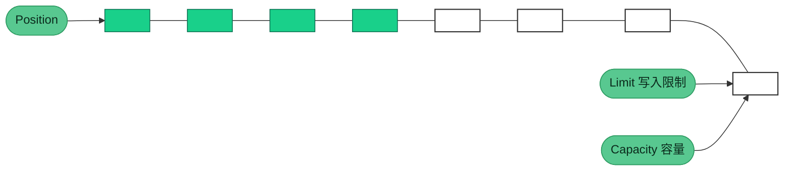
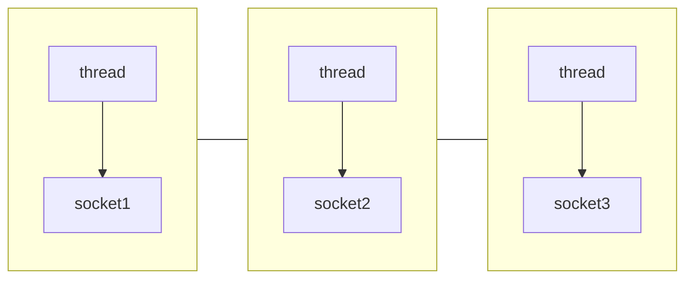
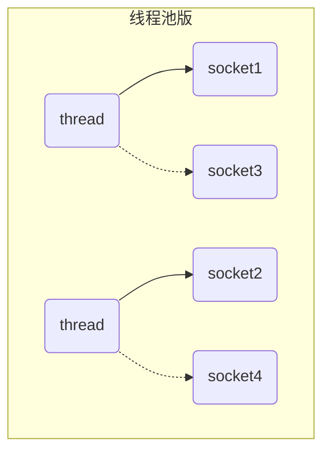
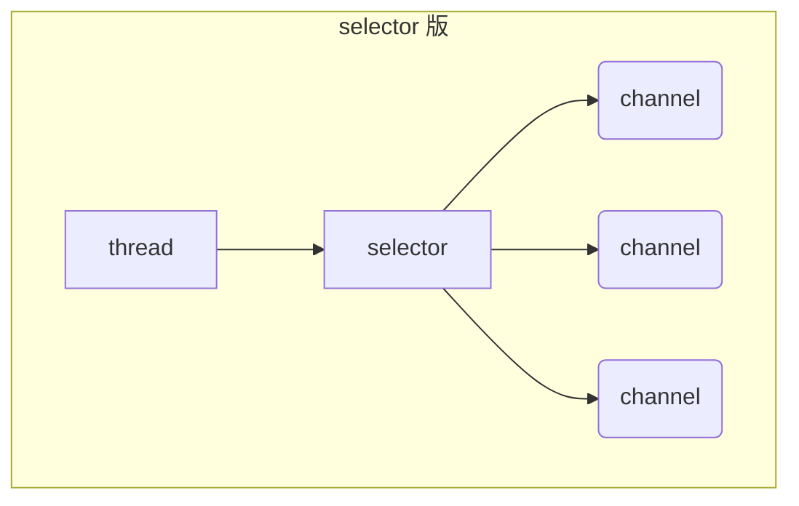

NIO基础知识介绍

## NIO基础

### 三大组件

#### Channel

Channel 是NIO 的核心组件，定义了 NIO 的核心功能，如：打开、关闭、绑定、监听、连接、读、写、获取通道属性等。

- FileChannel：文件通道，用于文件读写

- SocketChannel：socket 通道，用于 TCP 通信

- ServerSocketChannel：服务器 socket 通道，用于 UDP 通信

- DatagramChannel：数据报通道，用于 UDP 通信

#### ByteBuffer

ByteBuffer 是 NIO 的核心组件，它是 NIO 的核心抽象，是所有 NIO 组件的基础。Buffer 是 NIO 的核心抽象，它定义了 NIO 的核心功能，如：读、写、获取数据、设置数据、获取数据长度、获取数据起始位置、获取数据结束位置、获取数据类型。

> 主要属性

- capacity：缓冲区容量，表示缓冲区可以存储的最大字节数
- limit：缓冲区限制，表示缓冲区可以读取的最大字节数
- position：缓冲区位置，表示缓冲区可以读取的字节数
- mark：标记一个位置，后续使用reset()方法可恢复position

> 主要方法
- allocate()：指定缓冲区大小，分配一个缓冲区，返回一个缓冲区
- flip()：将缓冲区从写模式切换到读模式，limit设置为position，position设置为0
- clear()：清空缓冲区，将position设置为0，limit设置为capacity
- compact()：压缩缓冲区，将未使用的空间移动到缓冲区的起始位置，将position设置为limit，limit设置为capacity
- 向buffer写入数据
  - channel.read(buffer) 通道写入缓冲区
  - buffer.put(byte) 缓冲区写入一个字节
- 向buffer读取数据
  - channel.write(buffer) 获取缓冲区数据
  - buffer.get() 获取缓冲区数据
- get(i)：从指定位置读取一个字节，返回一个字节，不改变position
- mark()：设置缓冲区的标记位置，后续使用reset()方法可恢复position
- reset()：恢复缓冲区的位置，将position设置为mark，mark设置为-1
- rewind()：将position设置为0，limit设置为capacity

空闲缓冲区



写入数据后position指针移动


#### Selector

Selector 是 NIO 的核心组件，定义了 NIO 的核心功能，如：注册、取消注册、选择、获取已注册通道、获取已注册通道数量、获取已注册通道类型、获取已注册通道属性等。

##### 多线程模式

一个thread对应一个socket，流程图如下：



缺点：

* 内存占用高
* 线程上下文切换成本高
* 只适合连接数少的场景

##### 线程池模式



* 阻塞模式下，线程仅能处理一个 socket 连接
* 仅适合短连接场景

##### Selector 版设计

selector 的作用就是配合一个线程来管理多个 channel，获取这些 channel 上发生的事件，这些 channel 工作在非阻塞模式下，不会让线程吊死在一个 channel 上。适合连接数特别多，但流量低的场景（low traffic）



调用 selector 的 select() 会阻塞直到 channel 发生了读写就绪事件，这些事件发生，select 方法就会返回这些事件交给 thread 来处理

### 网络编程

#### 阻塞模式

* 阻塞模式下，相关方法都会导致线程暂停
  * ServerSocketChannel.accept 会在没有连接建立时让线程暂停
  * SocketChannel.read 会在没有数据可读时让线程暂停
  * 阻塞的表现其实就是线程暂停了，暂停期间不会占用 cpu，但线程相当于闲置
* 单线程下，阻塞方法之间相互影响，几乎不能正常工作，需要多线程支持
* 但多线程下，有新的问题，体现在以下方面
  * 32 位 jvm 一个线程 320k，64 位 jvm 一个线程 1024k，如果连接数过多，必然导致 OOM，并且线程太多，反而会因为频繁上下文切换导致性能降低
  * 可以采用线程池技术来减少线程数和线程上下文切换，但治标不治本，如果有很多连接建立，但长时间 inactive，会阻塞线程池中所有线程，因此不适合长连接，只适合短连接

> 服务器端

```java
public static void main(String[] args) {
    try {
        ByteBuffer buffer = ByteBuffer.allocate(1024);
        // 使用open()方法打开一个ServerSocketChannel
        ServerSocketChannel serverSocketChannel = ServerSocketChannel.open();
        // 绑定监听端口
        serverSocketChannel.bind(new InetSocketAddress(7000));

        // 创建一个SocketChannel列表用于保存所有连接
        List<SocketChannel> socketChannels = new ArrayList<>();;
        while (true) {
            // 接收连接，返回一个SocketChannel  阻塞方法
            // 没有获取到连接会一直阻塞
            SocketChannel socketChannel = serverSocketChannel.accept();
            if (socketChannel != null) {
                socketChannels.add(socketChannel);
                // 处理连接
                System.out.println("New connection: " + socketChannel.getRemoteAddress());
            }
            for (SocketChannel channel : socketChannels) {
                // 处理read事件  默认阻塞方法
                int read = channel.read(buffer);
                if (read > 0) {
                    // 处理读取到的数据
                    buffer.flip();
                    StringBuilder sb = new StringBuilder();
                    while (buffer.hasRemaining()) {
                        sb.append((char) buffer.get());
                    }
                    System.out.println("Received: " + sb);
                    buffer.clear();
                }
            }
        }
    } catch (IOException e) {
        e.printStackTrace();
    }
}
```

> 客户端

```java
public static void main(String[] args) {
    try {
        try (SocketChannel clientChannel = SocketChannel.open(new InetSocketAddress("127.0.0.1", 7000))) {
            System.out.println(clientChannel);
        }
    } catch (IOException e) {
        throw new RuntimeException(e);
    }
}
```

#### 非阻塞模式

* 非阻塞模式下，相关方法都会不会让线程暂停
  * 在 ServerSocketChannel.accept 在没有连接建立时，会返回 null，继续运行
  * SocketChannel.read 在没有数据可读时，会返回 0，但线程不必阻塞，可以去执行其它 SocketChannel 的 read 或是去执行 ServerSocketChannel.accept 
  * 写数据时，线程只是等待数据写入 Channel 即可，无需等 Channel 通过网络把数据发送出去
* 但非阻塞模式下，即使没有连接建立，和可读数据，线程仍然在不断运行，白白浪费了 cpu
* 数据复制过程中，线程实际还是阻塞的（AIO 改进的地方）

> 服务端

```java
public static void main(String[] args) {
    try {
        ByteBuffer buffer = ByteBuffer.allocate(1024);
        // 使用open()方法打开一个ServerSocketChannel
        ServerSocketChannel serverSocketChannel = ServerSocketChannel.open();
        // 绑定监听端口
        serverSocketChannel.bind(new InetSocketAddress(7000));
        // 设置为非阻塞模式
        serverSocketChannel.configureBlocking(false);
        List<SocketChannel> socketChannels = new ArrayList<>();
        ;
        while (true) {
            // 接收连接，返回一个SocketChannel
            SocketChannel socketChannel = serverSocketChannel.accept();
            if (socketChannel != null) {
                socketChannels.add(socketChannel);
                socketChannel.configureBlocking(false);
                // 处理连接
                System.out.println("New connection: " + socketChannel.getRemoteAddress());
            }
            for (SocketChannel channel : socketChannels) {
                // 处理read事件
                int read = channel.read(buffer);
                if (read > 0) {
                    // 处理读取到的数据
                    buffer.flip();
                    StringBuilder sb = new StringBuilder();
                    while (buffer.hasRemaining()) {
                        sb.append((char) buffer.get());
                    }
                    System.out.println("Received: " + sb);
                    buffer.clear();
                }
            }
        }
    } catch (IOException e) {
        e.printStackTrace();
    }
}
```

> 客户端

```java
public static void main(String[] args) {
    try {
        try (SocketChannel clientChannel = SocketChannel.open(new InetSocketAddress("127.0.0.1", 7000))) {
            System.out.println(clientChannel);
            while (true) {
                // do something
            }
        }
    } catch (IOException e) {
        throw new RuntimeException(e);
    }
}
```

#### 多路复用

单线程可以配合 Selector 完成对多个 Channel 可读写事件的监控，这称之为多路复用

* 多路复用仅针对网络 IO、普通文件 IO 没法利用多路复用
* 如果不用 Selector 的非阻塞模式，线程大部分时间都在做无用功，而 Selector 能够保证
  * 有可连接事件时才去连接
  * 有可读事件才去读取
  * 有可写事件才去写入
    * 限于网络传输能力，Channel 未必时时可写，一旦 Channel 可写，会触发 Selector 的可写事件

> 服务端

```java
ublic static void main(String[] args) throws IOException {
    // 创建一个selector
    Selector selector = Selector.open();
    // 使用open()方法打开一个ServerSocketChannel
    ServerSocketChannel ssc = ServerSocketChannel.open();
    // 绑定监听端口
    ssc.bind(new InetSocketAddress(7000));
    // 设置为非阻塞模式
    ssc.configureBlocking(false);
    // 把server的channel 注册到selector
    ssc.register(selector, SelectionKey.OP_ACCEPT);
    List<SocketChannel> socketChannels = new ArrayList<>();
    while (true) {
        // select方法，没有事件发生，线程阻塞，有事件，线程才会恢复运行
        // select 在事件未处理时, 它不会阻塞, 事件发生后要么处理, 要么取消(cancel)
        selector.select();
        Iterator<SelectionKey> iterator = selector.selectedKeys().iterator();
        while (iterator.hasNext()) {
            SelectionKey key = iterator.next();
            // 这里移除的是事件, 如果一次消息没有接受完, 那么事件会再次触发
            iterator.remove();
            log.debug("key: {}", key);
            if (key.isAcceptable()) {
                // 监听到连接事件
                ServerSocketChannel channel = (ServerSocketChannel) key.channel();
                SocketChannel sc = channel.accept();
                socketChannels.add(sc);
                sc.configureBlocking(false);
                // 把新的连接channel
                SelectionKey scKey = sc.register(selector, SelectionKey.OP_READ);
                ByteBuffer buffer = ByteBuffer.allocate(16);
                // attachment 附件，可以理解为与channel绑定的附件
                scKey.attach(buffer);
                log.debug("connected: {}", sc.getRemoteAddress());
            }
            if (key.isReadable()) {
                try {
                    SocketChannel channel = (SocketChannel) key.channel();
                    ByteBuffer buffer = (ByteBuffer) key.attachment();
                    // 处理read事件
                    int read = channel.read(buffer);
                    if (read == -1) {
                        // 处理客户端正常断开了连接
                        key.cancel();
                    } else if (read > 0) {
                        // 处理读取到的数据
                        split(buffer);
                        if (buffer.position() == buffer.limit()) {
                            // 缓冲区已满，需要扩容
                            ByteBuffer newBuffer = ByteBuffer.allocate(buffer.capacity() * 2);
                            buffer.flip();
                            newBuffer.put(buffer);
                            key.attach(newBuffer);
                        }
                    }
                } catch (IOException e) {
                    e.printStackTrace();
                    // 客户端断开了, 取消注册（从selector的keys集合中移除）
                    key.cancel();
                }
            }
        }
    }
}

private static void split(ByteBuffer source) {
    source.flip();
    for (int i = 0; i < source.limit(); i++) {
        // 通过\n分割读取
        if (source.get(i) == '\n') {
            int length = i + 1 - source.position();
            // 把这条完整消息存入新的 ByteBuffer
            ByteBuffer target = ByteBuffer.allocate(length);
            // 将source中的数据读取到target中
            for (int j = 0; j < length; j++) {
                target.put(source.get());
            }
            target.flip();
            System.out.print("read: " + Charset.defaultCharset().decode(target));
        }
    }
    source.compact();
}
```

> 客户端

```java
public static void main(String[] args) {
    try {
        try (SocketChannel clientChannel = SocketChannel.open(new InetSocketAddress("127.0.0.1", 7000))) {
            System.out.println(clientChannel);
            clientChannel.write(ByteBuffer.wrap("hello12356789abcdefg!!!\nworld\n".getBytes()));
            System.in.read();
        }
    } catch (IOException e) {
        throw new RuntimeException(e);
    }
}
```

#### 多线程Selector

> 现在都是多核 cpu，设计时要充分考虑别让 cpu 的力量被白白浪费

前面的代码只有一个选择器，没有充分利用多核 cpu，改进为下面的模式：

分两组选择器

* 单线程配一个选择器，专门处理 accept 事件
* 创建 cpu 核心数的线程，每个线程配一个选择器，轮流处理 read 事件

> 服务端

```java
public static void main(String[] args) throws IOException {
    new BossEventLoop().register();
}

@Slf4j
static class BossEventLoop implements Runnable {
    private Selector boss;
    private WorkerEventLoop[] workers;
    private volatile boolean start = false;
    AtomicInteger index = new AtomicInteger();

    public void register() throws IOException {
        if (!start) {
            ServerSocketChannel ssc = ServerSocketChannel.open();
            ssc.bind(new InetSocketAddress(7000));
            ssc.configureBlocking(false);
            boss = Selector.open();
            SelectionKey ssckey = ssc.register(boss, 0, null);
            ssckey.interestOps(SelectionKey.OP_ACCEPT);
            workers = initEventLoops();
            new Thread(this, "boss").start();
            log.debug("boss start...");
            start = true;
        }
    }

    public WorkerEventLoop[] initEventLoops() {
        // EventLoop[] eventLoops = new EventLoop[Runtime.getRuntime().availableProcessors()];
        WorkerEventLoop[] workerEventLoops = new WorkerEventLoop[2];
        for (int i = 0; i < workerEventLoops.length; i++) {
            workerEventLoops[i] = new WorkerEventLoop(i);
        }
        return workerEventLoops;
    }

    @Override
    public void run() {
        while (true) {
            try {
                boss.select();
                Iterator<SelectionKey> iter = boss.selectedKeys().iterator();
                while (iter.hasNext()) {
                    SelectionKey key = iter.next();
                    iter.remove();
                    if (key.isAcceptable()) {
                        ServerSocketChannel c = (ServerSocketChannel) key.channel();
                        SocketChannel sc = c.accept();
                        sc.configureBlocking(false);
                        log.debug("{} connected", sc.getRemoteAddress());
                        workers[index.getAndIncrement() % workers.length].register(sc);
                    }
                }
            } catch (IOException e) {
                e.printStackTrace();
            }
        }
    }
}

@Slf4j
static class WorkerEventLoop implements Runnable {
    private Selector worker;
    private volatile boolean start = false;
    private int index;

    private final ConcurrentLinkedQueue<Runnable> tasks = new ConcurrentLinkedQueue<>();

    public WorkerEventLoop(int index) {
        this.index = index;
    }

    public void register(SocketChannel sc) throws IOException {
        if (!start) {
            worker = Selector.open();
            new Thread(this, "worker-" + index).start();
            start = true;
        }
        tasks.add(() -> {
            try {
                SelectionKey sckey = sc.register(worker, 0, null);
                sckey.interestOps(SelectionKey.OP_READ);
                worker.selectNow();
            } catch (IOException e) {
                e.printStackTrace();
            }
        });
        worker.wakeup();
    }

    @Override
    public void run() {
        while (true) {
            try {
                worker.select();
                Runnable task = tasks.poll();
                if (task != null) {
                    task.run();
                }
                Set<SelectionKey> keys = worker.selectedKeys();
                Iterator<SelectionKey> iter = keys.iterator();
                while (iter.hasNext()) {
                    SelectionKey key = iter.next();
                    if (key.isReadable()) {
                        SocketChannel sc = (SocketChannel) key.channel();
                        ByteBuffer buffer = ByteBuffer.allocate(128);
                        try {
                            int read = sc.read(buffer);
                            if (read == -1) {
                                key.cancel();
                                sc.close();
                            } else {
                                buffer.flip();
                                log.debug("{} message:", sc.getRemoteAddress());
                                debugAll(buffer);
                            }
                        } catch (IOException e) {
                            e.printStackTrace();
                            key.cancel();
                            sc.close();
                        }
                    }
                    iter.remove();
                }
            } catch (IOException e) {
                e.printStackTrace();
            }
        }
    }
}
```

* Runtime.getRuntime().availableProcessors() 如果工作在 docker 容器下，因为容器不是物理隔离的，会拿到物理 cpu 个数，而不是容器申请时的个数
* 这个问题直到 jdk 10 才修复，使用 jvm 参数 UseContainerSupport 配置， 默认开启

> 客户端

```java
public static void main(String[] args) {
    try {
        try (SocketChannel clientChannel = SocketChannel.open(new InetSocketAddress("127.0.0.1", 7000))) {
            System.out.println(clientChannel);
            clientChannel.write(ByteBuffer.wrap("hello12356789abcdefg!!!\nworld\n".getBytes()));
            System.in.read();
        }
    } catch (IOException e) {
        throw new RuntimeException(e);
    }
}
```

### NIO vs BIO

#### stream vs channel

* stream 不会自动缓冲数据，channel 会利用系统提供的发送缓冲区、接收缓冲区（更为底层）
* stream 仅支持阻塞 API，channel 同时支持阻塞、非阻塞 API，网络 channel 可配合 selector 实现多路复用
* 二者均为全双工，即读写可以同时进行

#### IO 模型

同步阻塞、同步非阻塞、同步多路复用、异步阻塞（没有此情况）、异步非阻塞

* 同步：线程自己去获取结果（一个线程）
* 异步：线程自己不去获取结果，而是由其它线程送结果（至少两个线程）

当调用一次 channel.read 或 stream.read 后，会切换至操作系统内核态来完成真正数据读取，而读取又分为两个阶段，分别为：

* 等待数据阶段
* 复制数据阶段


- 阻塞 IO

  

- 非阻塞 IO

  

- 多路复用

  

- 信号驱动

- 异步IO

  

- 阻塞IO vs 多路复用

  

  

#### 零拷贝

##### 传统 IO 问题

传统的 IO 将一个文件通过 socket 写出

```java
File f = new File("helloword/data.txt");
RandomAccessFile file = new RandomAccessFile(file, "r");

byte[] buf = new byte[(int)f.length()];
file.read(buf);

Socket socket = ...;
socket.getOutputStream().write(buf);
```

内部工作流程是这样的：


1. java 本身并不具备 IO 读写能力，因此 read 方法调用后，要从 java 程序的**用户态**切换至**内核态**，去调用操作系统（Kernel）的读能力，将数据读入**内核缓冲区**。这期间用户线程阻塞，操作系统使用 DMA（Direct Memory Access）来实现文件读，其间也不会使用 cpu

   > DMA 也可以理解为硬件单元，用来解放 cpu 完成文件 IO

2. 从**内核态**切换回**用户态**，将数据从**内核缓冲区**读入**用户缓冲区**（即 byte[] buf），这期间 cpu 会参与拷贝，无法利用 DMA

3. 调用 write 方法，这时将数据从**用户缓冲区**（byte[] buf）写入 **socket 缓冲区**，cpu 会参与拷贝

4. 接下来要向网卡写数据，这项能力 java 又不具备，因此又得从**用户态**切换至**内核态**，调用操作系统的写能力，使用 DMA 将 **socket 缓冲区**的数据写入网卡，不会使用 cpu

##### NIO 优化

通过 DirectByteBuf 

* ByteBuffer.allocate(10)  HeapByteBuffer 使用的还是 java 内存
* ByteBuffer.allocateDirect(10)  DirectByteBuffer 使用的是操作系统内存


大部分步骤与优化前相同，不再赘述。唯有一点：java 可以使用 DirectByteBuf 将堆外内存映射到 jvm 内存中来直接访问使用

* 这块内存不受 jvm 垃圾回收的影响，因此内存地址固定，有助于 IO 读写
* java 中的 DirectByteBuf 对象仅维护了此内存的虚引用，内存回收分成两步
  * DirectByteBuf 对象被垃圾回收，将虚引用加入引用队列
  * 通过专门线程访问引用队列，根据虚引用释放堆外内存
* 减少了一次数据拷贝，用户态与内核态的切换次数没有减少


进一步优化（底层采用了 linux 2.1 后提供的 sendFile 方法），java 中对应着两个 channel 调用 transferTo/transferFrom 方法拷贝数据


1. java 调用 transferTo 方法后，要从 java 程序的**用户态**切换至**内核态**，使用 DMA将数据读入**内核缓冲区**，不会使用 cpu
2. 数据从**内核缓冲区**传输到 **socket 缓冲区**，cpu 会参与拷贝
3. 最后使用 DMA 将 **socket 缓冲区**的数据写入网卡，不会使用 cpu

可以看到

* 只发生了一次用户态与内核态的切换
* 数据拷贝了 3 次

进一步优化（linux 2.4）


1. java 调用 transferTo 方法后，要从 java 程序的**用户态**切换至**内核态**，使用 DMA将数据读入**内核缓冲区**，不会使用 cpu
2. 只会将一些 offset 和 length 信息拷入 **socket 缓冲区**，几乎无消耗
3. 使用 DMA 将 **内核缓冲区**的数据写入网卡，不会使用 cpu

整个过程仅只发生了一次用户态与内核态的切换，数据拷贝了 2 次。所谓的【零拷贝】，并不是真正无拷贝，而是在不会拷贝重复数据到 jvm 内存中，零拷贝的优点有

* 更少的用户态与内核态的切换
* 不利用 cpu 计算，减少 cpu 缓存伪共享
* 零拷贝适合小文件传输

#### AIO

AIO 用来解决数据复制阶段的阻塞问题

* 同步意味着，在进行读写操作时，线程需要等待结果，还是相当于闲置
* 异步意味着，在进行读写操作时，线程不必等待结果，而是将来由操作系统来通过回调方式由另外的线程来获得结果

> 异步模型需要底层操作系统（Kernel）提供支持
>
> * Windows 系统通过 IOCP 实现了真正的异步 IO
> * Linux 系统异步 IO 在 2.6 版本引入，但其底层实现还是用多路复用模拟了异步 IO，性能没有优势

##### 文件 AIO

先来看看 AsynchronousFileChannel

```java
public static void main(String[] args) throws IOException {
    try {
        AsynchronousFileChannel s =
            AsynchronousFileChannel.open(
            Paths.get("1.txt"), StandardOpenOption.READ);
        ByteBuffer buffer = ByteBuffer.allocate(2);
        log.debug("begin...");
        s.read(buffer, 0, null, new CompletionHandler<Integer, ByteBuffer>() {
            @Override
            public void completed(Integer result, ByteBuffer attachment) {
                log.debug("read completed...{}", result);
                buffer.flip();
                debugAll(buffer);
            }

            @Override
            public void failed(Throwable exc, ByteBuffer attachment) {
                log.debug("read failed...");
            }
        });

    } catch (IOException e) {
        e.printStackTrace();
    }
    log.debug("do other things...");
    System.in.read();
}
```

输出

```
21:22:34 [DEBUG] [main] c.m.aio.FileAio - begin...
21:22:34 [DEBUG] [main] c.m.aio.FileAio - do other things...
21:22:34 [DEBUG] [Thread-18] c.m.aio.FileAio - read completed...2
+--------+-------------------- all ------------------------+----------------+
position: [0], limit: [2]
         +-------------------------------------------------+
         |  0  1  2  3  4  5  6  7  8  9  a  b  c  d  e  f |
+--------+-------------------------------------------------+----------------+
|00000000| 31 32                                           |12              |
+--------+-------------------------------------------------+----------------+
```

可以看到

* 响应文件读取成功的是另一个线程 Thread-18
* 主线程并没有 IO 操作阻塞


💡 守护线程

默认文件 AIO 使用的线程都是守护线程，所以最后要执行 `System.in.read()` 以避免守护线程意外结束

##### 网络IO

```java
public static void main(String[] args) throws IOException {
    AsynchronousServerSocketChannel ssc = AsynchronousServerSocketChannel.open();
    ssc.bind(new InetSocketAddress(7000));
    ssc.accept(null, new AcceptHandler(ssc));
    System.in.read();
}

private static void closeChannel(AsynchronousSocketChannel sc) {
    try {
        System.out.printf("[%s] %s close\n", Thread.currentThread().getName(), sc.getRemoteAddress());
        sc.close();
    } catch (IOException e) {
        e.printStackTrace();
    }
}

private static class ReadHandler implements CompletionHandler<Integer, ByteBuffer> {
    private final AsynchronousSocketChannel sc;

    public ReadHandler(AsynchronousSocketChannel sc) {
        this.sc = sc;
    }

    @Override
    public void completed(Integer result, ByteBuffer attachment) {
        try {
            if (result == -1) {
                closeChannel(sc);
                return;
            }
            System.out.printf("[%s] %s read\n", Thread.currentThread().getName(), sc.getRemoteAddress());
            attachment.flip();
            System.out.println(Charset.defaultCharset().decode(attachment));
            attachment.clear();
            // 处理完第一个 read 时，需要再次调用 read 方法来处理下一个 read 事件
            sc.read(attachment, attachment, this);
        } catch (IOException e) {
            e.printStackTrace();
        }
    }

    @Override
    public void failed(Throwable exc, ByteBuffer attachment) {
        closeChannel(sc);
        exc.printStackTrace();
    }
}

private static class WriteHandler implements CompletionHandler<Integer, ByteBuffer> {
    private final AsynchronousSocketChannel sc;

    private WriteHandler(AsynchronousSocketChannel sc) {
        this.sc = sc;
    }

    @Override
    public void completed(Integer result, ByteBuffer attachment) {
        // 如果作为附件的 buffer 还有内容，需要再次 write 写出剩余内容
        if (attachment.hasRemaining()) {
            sc.write(attachment);
        }
    }

    @Override
    public void failed(Throwable exc, ByteBuffer attachment) {
        exc.printStackTrace();
        closeChannel(sc);
    }
}

private static class AcceptHandler implements CompletionHandler<AsynchronousSocketChannel, Object> {
    private final AsynchronousServerSocketChannel ssc;

    public AcceptHandler(AsynchronousServerSocketChannel ssc) {
        this.ssc = ssc;
    }

    @Override
    public void completed(AsynchronousSocketChannel sc, Object attachment) {
        try {
            System.out.printf("[%s] %s connected\n", Thread.currentThread().getName(), sc.getRemoteAddress());
        } catch (IOException e) {
            e.printStackTrace();
        }
        ByteBuffer buffer = ByteBuffer.allocate(16);
        // 读事件由 ReadHandler 处理
        sc.read(buffer, buffer, new ReadHandler(sc));
        // 写事件由 WriteHandler 处理
        sc.write(Charset.defaultCharset().encode("server hello!"), ByteBuffer.allocate(16), new WriteHandler(sc));
        // 处理完第一个 accpet 时，需要再次调用 accept 方法来处理下一个 accept 事件
        ssc.accept(null, this);
    }

    @Override
    public void failed(Throwable exc, Object attachment) {
        exc.printStackTrace();
    }
}
```

