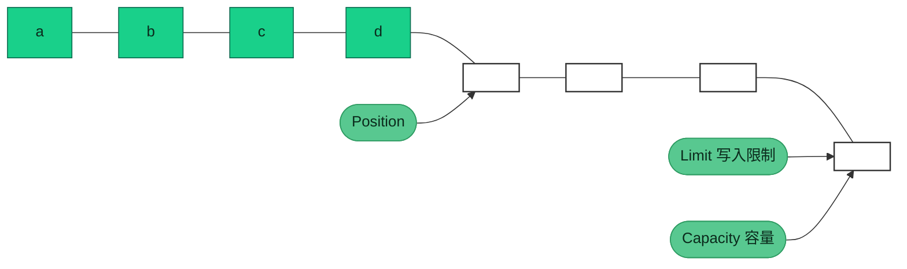
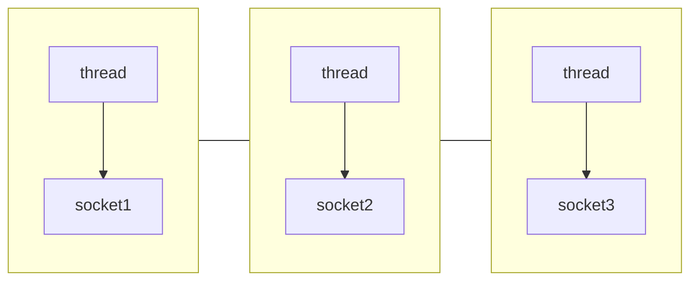
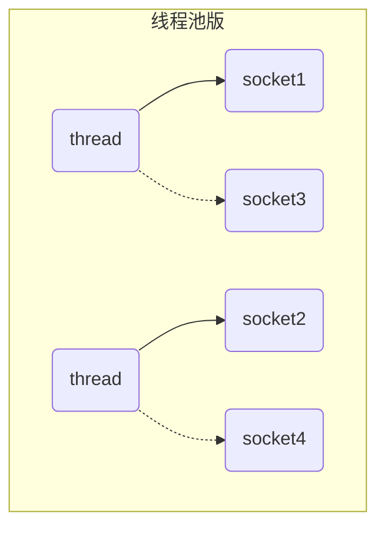
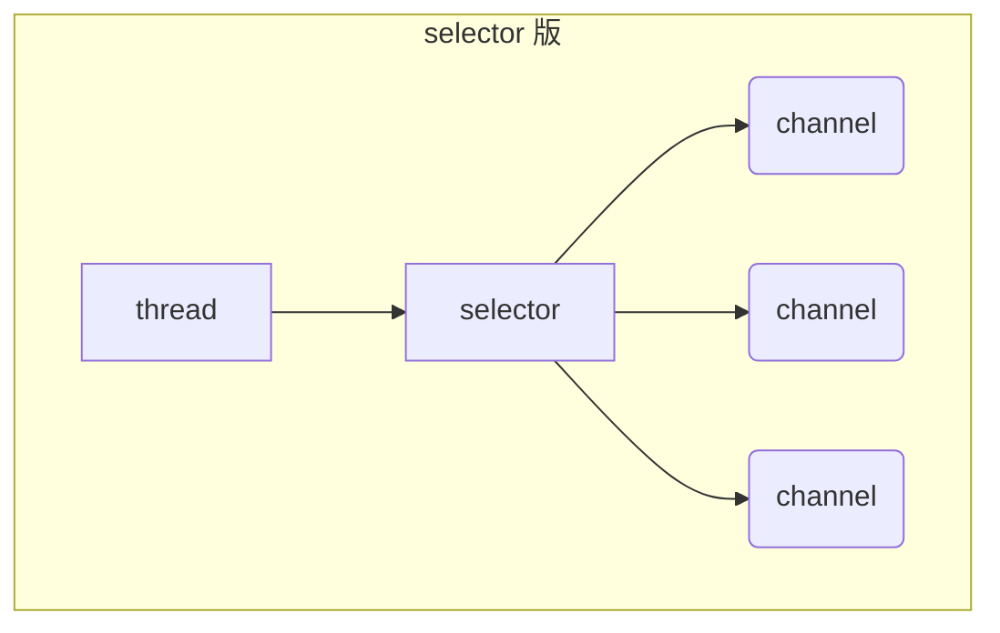

NIO基础知识介绍

## NIO基础

### 三大组件

#### Channel

Channel 是NIO 的核心组件，定义了 NIO 的核心功能，如：打开、关闭、绑定、监听、连接、读、写、获取通道属性等。

- FileChannel：文件通道，用于文件读写

- SocketChannel：socket 通道，用于 TCP 通信

- ServerSocketChannel：服务器 socket 通道，用于 UDP 通信

- DatagramChannel：数据报通道，用于 UDP 通信

#### ByteBuffer

ByteBuffer 是 NIO 的核心组件，它是 NIO 的核心抽象，是所有 NIO 组件的基础。Buffer 是 NIO 的核心抽象，它定义了 NIO 的核心功能，如：读、写、获取数据、设置数据、获取数据长度、获取数据起始位置、获取数据结束位置、获取数据类型。

> 主要属性

- capacity：缓冲区容量，表示缓冲区可以存储的最大字节数
- limit：缓冲区限制，表示缓冲区可以读取的最大字节数
- position：缓冲区位置，表示缓冲区可以读取的字节数
- mark：标记一个位置，后续使用reset()方法可恢复position

> 主要方法
- allocate()：指定缓冲区大小，分配一个缓冲区，返回一个缓冲区
- flip()：将缓冲区从写模式切换到读模式，limit设置为position，position设置为0
- clear()：清空缓冲区，将position设置为0，limit设置为capacity
- compact()：压缩缓冲区，将未使用的空间移动到缓冲区的起始位置，将position设置为limit，limit设置为capacity
- 向buffer写入数据
  - channel.read(buffer) 通道写入缓冲区
  - buffer.put(byte) 缓冲区写入一个字节
- 向buffer读取数据
  - channel.write(buffer) 获取缓冲区数据
  - buffer.get() 获取缓冲区数据
- get(i)：从指定位置读取一个字节，返回一个字节，不改变position
- mark()：设置缓冲区的标记位置，后续使用reset()方法可恢复position
- reset()：恢复缓冲区的位置，将position设置为mark，mark设置为-1
- rewind()：将position设置为0，limit设置为capacity

空闲缓冲区


写入数据后position指针移动



#### Selector

Selector 是 NIO 的核心组件，定义了 NIO 的核心功能，如：注册、取消注册、选择、获取已注册通道、获取已注册通道数量、获取已注册通道类型、获取已注册通道属性等。

##### 多线程模式

一个thread对应一个socket，流程图如下：



缺点：

* 内存占用高
* 线程上下文切换成本高
* 只适合连接数少的场景

##### 线程池模式



* 阻塞模式下，线程仅能处理一个 socket 连接
* 仅适合短连接场景

##### Selector 版设计

selector 的作用就是配合一个线程来管理多个 channel，获取这些 channel 上发生的事件，这些 channel 工作在非阻塞模式下，不会让线程吊死在一个 channel 上。适合连接数特别多，但流量低的场景（low traffic）



调用 selector 的 select() 会阻塞直到 channel 发生了读写就绪事件，这些事件发生，select 方法就会返回这些事件交给 thread 来处理

### 网络编程

#### 阻塞模式

* 阻塞模式下，相关方法都会导致线程暂停
  * ServerSocketChannel.accept 会在没有连接建立时让线程暂停
  * SocketChannel.read 会在没有数据可读时让线程暂停
  * 阻塞的表现其实就是线程暂停了，暂停期间不会占用 cpu，但线程相当于闲置
* 单线程下，阻塞方法之间相互影响，几乎不能正常工作，需要多线程支持
* 但多线程下，有新的问题，体现在以下方面
  * 32 位 jvm 一个线程 320k，64 位 jvm 一个线程 1024k，如果连接数过多，必然导致 OOM，并且线程太多，反而会因为频繁上下文切换导致性能降低
  * 可以采用线程池技术来减少线程数和线程上下文切换，但治标不治本，如果有很多连接建立，但长时间 inactive，会阻塞线程池中所有线程，因此不适合长连接，只适合短连接

> 服务器端

```java
public static void main(String[] args) {
    try {
        ByteBuffer buffer = ByteBuffer.allocate(1024);
        // 使用open()方法打开一个ServerSocketChannel
        ServerSocketChannel serverSocketChannel = ServerSocketChannel.open();
        // 绑定监听端口
        serverSocketChannel.bind(new InetSocketAddress(7000));

        // 创建一个SocketChannel列表用于保存所有连接
        List<SocketChannel> socketChannels = new ArrayList<>();;
        while (true) {
            // 接收连接，返回一个SocketChannel  阻塞方法
            // 没有获取到连接会一直阻塞
            SocketChannel socketChannel = serverSocketChannel.accept();
            if (socketChannel != null) {
                socketChannels.add(socketChannel);
                // 处理连接
                System.out.println("New connection: " + socketChannel.getRemoteAddress());
            }
            for (SocketChannel channel : socketChannels) {
                // 处理read事件  默认阻塞方法
                int read = channel.read(buffer);
                if (read > 0) {
                    // 处理读取到的数据
                    buffer.flip();
                    StringBuilder sb = new StringBuilder();
                    while (buffer.hasRemaining()) {
                        sb.append((char) buffer.get());
                    }
                    System.out.println("Received: " + sb);
                    buffer.clear();
                }
            }
        }
    } catch (IOException e) {
        e.printStackTrace();
    }
}
```

> 客户端

```java
public static void main(String[] args) {
    try {
        try (SocketChannel clientChannel = SocketChannel.open(new InetSocketAddress("127.0.0.1", 7000))) {
            System.out.println(clientChannel);
        }
    } catch (IOException e) {
        throw new RuntimeException(e);
    }
}
```

#### 非阻塞模式

* 非阻塞模式下，相关方法都会不会让线程暂停
  * 在 ServerSocketChannel.accept 在没有连接建立时，会返回 null，继续运行
  * SocketChannel.read 在没有数据可读时，会返回 0，但线程不必阻塞，可以去执行其它 SocketChannel 的 read 或是去执行 ServerSocketChannel.accept 
  * 写数据时，线程只是等待数据写入 Channel 即可，无需等 Channel 通过网络把数据发送出去
* 但非阻塞模式下，即使没有连接建立，和可读数据，线程仍然在不断运行，白白浪费了 cpu
* 数据复制过程中，线程实际还是阻塞的（AIO 改进的地方）

> 服务端

```java
public static void main(String[] args) {
    try {
        ByteBuffer buffer = ByteBuffer.allocate(1024);
        // 使用open()方法打开一个ServerSocketChannel
        ServerSocketChannel serverSocketChannel = ServerSocketChannel.open();
        // 绑定监听端口
        serverSocketChannel.bind(new InetSocketAddress(7000));
        // 设置为非阻塞模式
        serverSocketChannel.configureBlocking(false);
        List<SocketChannel> socketChannels = new ArrayList<>();
        ;
        while (true) {
            // 接收连接，返回一个SocketChannel
            SocketChannel socketChannel = serverSocketChannel.accept();
            if (socketChannel != null) {
                socketChannels.add(socketChannel);
                socketChannel.configureBlocking(false);
                // 处理连接
                System.out.println("New connection: " + socketChannel.getRemoteAddress());
            }
            for (SocketChannel channel : socketChannels) {
                // 处理read事件
                int read = channel.read(buffer);
                if (read > 0) {
                    // 处理读取到的数据
                    buffer.flip();
                    StringBuilder sb = new StringBuilder();
                    while (buffer.hasRemaining()) {
                        sb.append((char) buffer.get());
                    }
                    System.out.println("Received: " + sb);
                    buffer.clear();
                }
            }
        }
    } catch (IOException e) {
        e.printStackTrace();
    }
}
```

> 客户端

```java
public static void main(String[] args) {
    try {
        try (SocketChannel clientChannel = SocketChannel.open(new InetSocketAddress("127.0.0.1", 7000))) {
            System.out.println(clientChannel);
            while (true) {
                // do something
            }
        }
    } catch (IOException e) {
        throw new RuntimeException(e);
    }
}
```

#### 多路复用

单线程可以配合 Selector 完成对多个 Channel 可读写事件的监控，这称之为多路复用

* 多路复用仅针对网络 IO、普通文件 IO 没法利用多路复用
* 如果不用 Selector 的非阻塞模式，线程大部分时间都在做无用功，而 Selector 能够保证
  * 有可连接事件时才去连接
  * 有可读事件才去读取
  * 有可写事件才去写入
    * 限于网络传输能力，Channel 未必时时可写，一旦 Channel 可写，会触发 Selector 的可写事件

