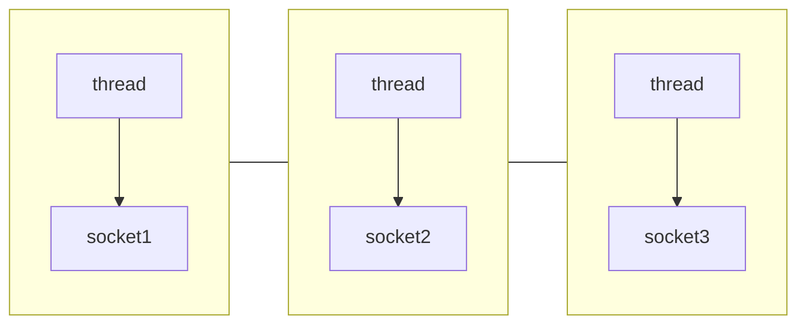

Netty 三大组件介绍

## Channel

Channel 是 Netty 的核心组件，它是 Netty 的核心抽象，是所有 Netty 组件的基础。Channel 是一个接口，它定义了 Netty 的核心功能，如：读、写、连接、绑定、关闭、获取远程地址、获取本地地址、获取通道类型、获取通道配置、获取通道属性等。

- FileChannel：文件通道，用于文件读写

- SocketChannel：socket 通道，用于 TCP 通信

- ServerSocketChannel：服务器 socket 通道，用于 UDP 通信

- DatagramChannel：数据报通道，用于 UDP 通信

## Buffer

Buffer 是 Netty 的核心组件，它是 Netty 的核心抽象，是所有 Netty 组件的基础。Buffer 是 Netty 的核心抽象，它定义了 Netty 的核心功能，如：读、写、获取数据、设置数据、获取数据长度、获取数据起始位置、获取数据结束位置、获取数据类型。

- ByteBuffer：字节缓冲区，用于字节读写
  - MappedByteBuffer：映射字节缓冲区，用于映射文件
  - DirectByteBuffer：直接字节缓冲区，用于直接内存读写
  - HeapByteBuffer：堆字节缓冲区，用于堆内存读写
- ShortBuffer：短整数缓冲区，用于短整数读写
- IntBuffer：整数缓冲区，用于整数读写
- LongBuffer：长整数缓冲区，用于长整数读写
- FloatBuffer：浮点缓冲区，用于浮点读写
- DoubleBuffer：双精度缓冲区，用于双精度读写

## Selector

Selector 是 Netty 的核心组件，它是 Netty 的核心抽象，是所有 Netty 组件的基础。Selector 是 Netty 的核心抽象，它定义了 Netty 的核心功能，如：注册、取消注册、选择、获取已注册通道、获取已注册通道数量、获取已注册通道类型、获取已注册通道属性等。

### 多线程模式

一个thread对应一个socket，流程图如下：

