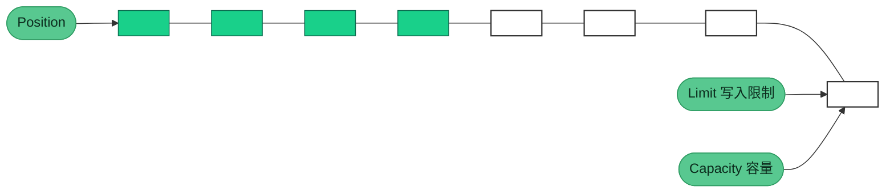
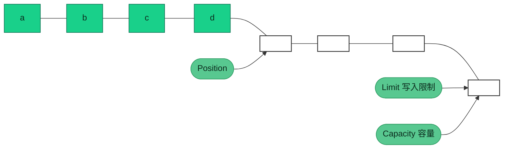
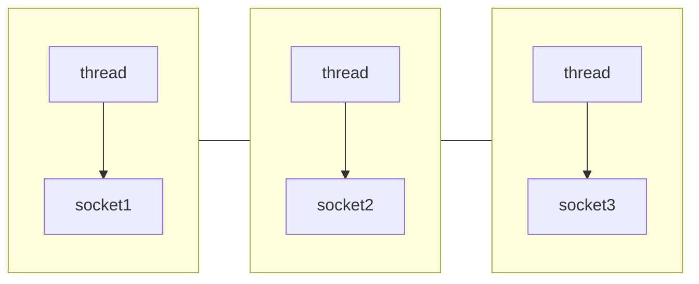
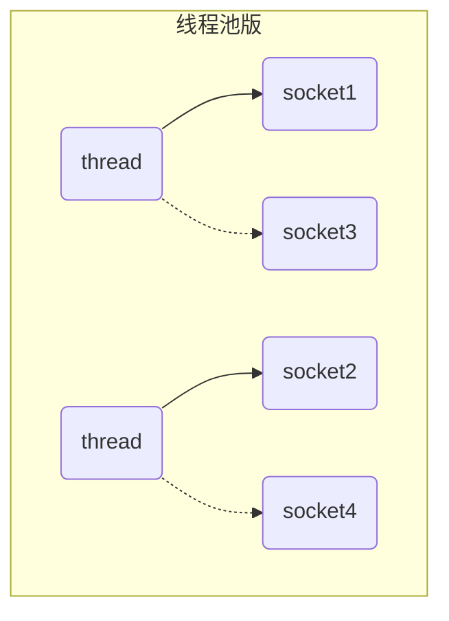
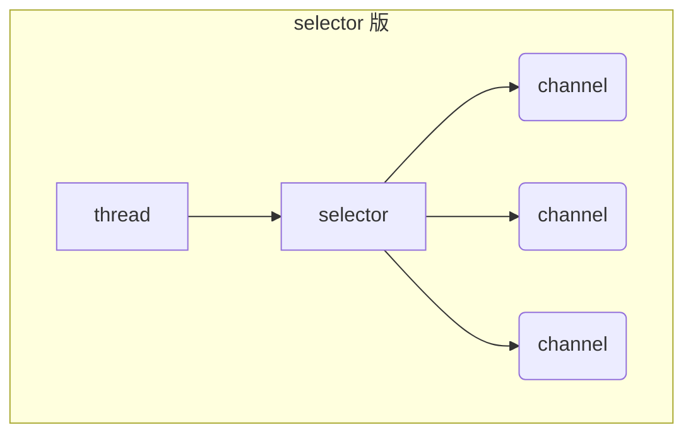

### 三大组件

#### Channel

Channel 是NIO 的核心组件，定义了 NIO 的核心功能，如：打开、关闭、绑定、监听、连接、读、写、获取通道属性等。

- FileChannel：文件通道，用于文件读写

- SocketChannel：socket 通道，用于 TCP 通信

- ServerSocketChannel：服务器 socket 通道，用于 UDP 通信

- DatagramChannel：数据报通道，用于 UDP 通信

#### ByteBuffer

ByteBuffer 是 NIO 的核心组件，它是 NIO 的核心抽象，是所有 NIO 组件的基础。Buffer 是 NIO 的核心抽象，它定义了 NIO 的核心功能，如：读、写、获取数据、设置数据、获取数据长度、获取数据起始位置、获取数据结束位置、获取数据类型。

> 主要属性

- capacity：缓冲区容量，表示缓冲区可以存储的最大字节数
- limit：缓冲区限制，表示缓冲区可以读取的最大字节数
- position：缓冲区位置，表示缓冲区可以读取的字节数
- mark：标记一个位置，后续使用reset()方法可恢复position

> 主要方法
- allocate()：指定缓冲区大小，分配一个缓冲区，返回一个缓冲区
- flip()：将缓冲区从写模式切换到读模式，limit设置为position，position设置为0
- clear()：清空缓冲区，将position设置为0，limit设置为capacity
- compact()：压缩缓冲区，将未使用的空间移动到缓冲区的起始位置，将position设置为limit，limit设置为capacity
- 向buffer写入数据
  - channel.read(buffer) 通道写入缓冲区
  - buffer.put(byte) 缓冲区写入一个字节
- 向buffer读取数据
  - channel.write(buffer) 获取缓冲区数据
  - buffer.get() 获取缓冲区数据
- get(i)：从指定位置读取一个字节，返回一个字节，不改变position
- mark()：设置缓冲区的标记位置，后续使用reset()方法可恢复position
- reset()：恢复缓冲区的位置，将position设置为mark，mark设置为-1
- rewind()：将position设置为0，limit设置为capacity

空闲缓冲区

写入数据后position指针移动

#### Selector

Selector 是 NIO 的核心组件，定义了 NIO 的核心功能，如：注册、取消注册、选择、获取已注册通道、获取已注册通道数量、获取已注册通道类型、获取已注册通道属性等。

##### 多线程模式

一个thread对应一个socket，流程图如下：

缺点：

* 内存占用高
* 线程上下文切换成本高
* 只适合连接数少的场景

##### 线程池模式

* 阻塞模式下，线程仅能处理一个 socket 连接
* 仅适合短连接场景

##### Selector 版设计

selector 的作用就是配合一个线程来管理多个 channel，获取这些 channel 上发生的事件，这些 channel 工作在非阻塞模式下，不会让线程吊死在一个 channel 上。适合连接数特别多，但流量低的场景（low traffic）

调用 selector 的 select() 会阻塞直到 channel 发生了读写就绪事件，这些事件发生，select 方法就会返回这些事件交给 thread 来处理
